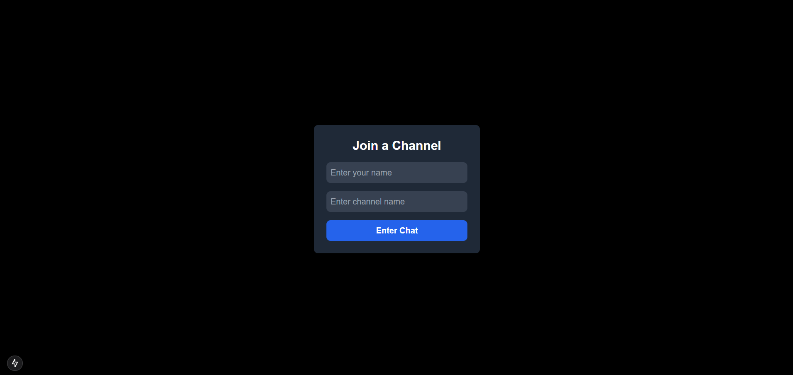
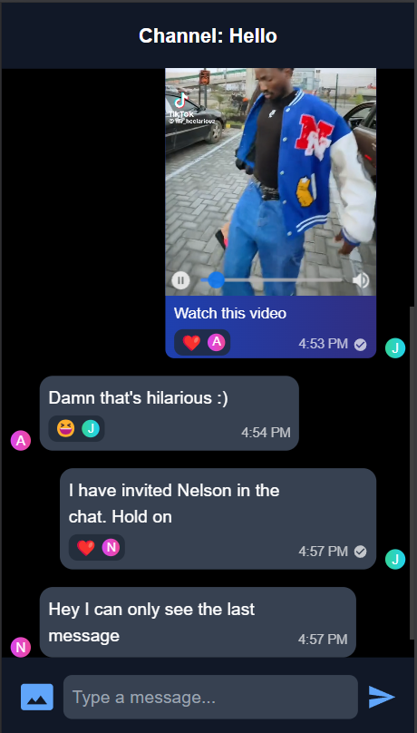
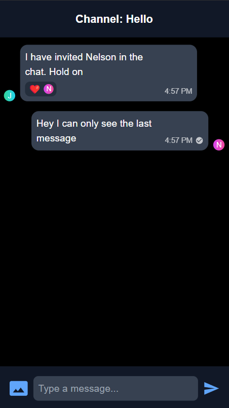

# Real-time Messenger Application

A modern real-time chat application built with Next.js and Pusher, featuring a beautiful dark UI and rich messaging capabilities.

## Live Demo

Check out the live demo here: [Live Demo](https://alihs.vercel.app/)

```bash
https://alihs.vercel.app/
```

> **Note:** The demo provides a preview of the app's main features.

## Features

- 💬 Real-time messaging
- 🌓 Dark theme UI
- 👥 User presence detection
- 📷 Image sharing with previews
- 🎥 Video sharing with custom player
- 😊 Emoji reactions
- ✅ Message status indicators
- 🔗 Link previews
- 📱 Responsive design
- 💾 File sharing support

## Technologies

- Next.js 13+
- Pusher for real-time functionality
- MongoDB for message storage
- TailwindCSS for styling
- Cloudinary for media storage

## Setup

1. Clone the repository

```bash
git clone https://github.com/jiniyasshah/messenger.git
cd messenger
```

2. Install dependencies

```bash
npm install
```

3. Set up environment variables

```bash
PUSHER_APP_ID=
NEXT_PUBLIC_PUSHER_APP_KEY=
PUSHER_SECRET=
NEXT_PUBLIC_PUSHER_CLUSTER=
DATABASE_URL=
CLOUDINARY_CLOUD_NAME=
CLOUDINARY_API_KEY=
CLOUDINARY_API_SECRET=
```

4.Run the development server

```bash
npm run dev
```

## Usage

1. Enter your name and channel on the home page
2. Start chatting in real-time
3. Share images and videos by clicking the attachment button
4. React to messages by clicking on them
5. See user presence and message status in real-time

## Project Structure

```
app/
├── api/           # API routes
├── channel/       # Channel pages
├── components/    # Reusable components
├── hooks/         # Custom hooks
└── pages/         # App pages
```

## Security & Future Goals

### Planned Features

- End-to-end encryption
- Backend user presence logic
- Message persistence
- User authentication (optional)
- Private channels
- Group chat support
- Voice messages
- Video calls

### Security Roadmap

- Implement E2E encryption using Signal Protocol
- Secure file sharing
- Rate limiting
- Message validation
- Input sanitization

## Screenshots

### Landing Page



### Conversation & File Sharing



### Limited Message Visibility

- Only users present during the communication can actually see the message.



## License

This project is licensed under the MIT License - see the [LICENSE](LICENSE) file for details.

## Contributing

1. Fork the repository.
2. Create a new branch (`git checkout -b feature-branch`).
3. Make your changes and commit them (`git commit -am 'Add feature'`).
4. Push to the branch (`git push origin feature-branch`).
5. Create a new pull request.

We welcome all contributions! Please make sure your code adheres to the existing coding style, and include tests for new functionality where applicable.
